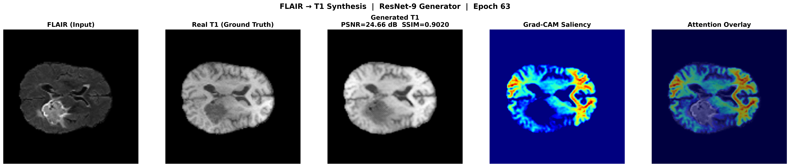

# Explainable FLAIR-to-T1 MRI Synthesis: Interpretable Residual GANs

Official implementation of the paper accepted at the **International Conference on Cyber Security, Data Science & Machine Learning (ICCDM-2026)**, published in the **Springer LNNS Series** (indexed: Scopus, zbMATH, DBLP, EI Compendex, SCImago).

---

## Abstract

Cross-modal MRI synthesis enables clinicians to obtain missing diagnostic information without additional scans, yet existing deep learning models lack interpretability. We introduce an explainable conditional GAN that synthesises high-fidelity T1-weighted images from FLAIR scans. The architecture augments Pix2Pix with a ResNet-9 generator (11.4M parameters) and PatchGAN discriminator, with Grad-CAM integrated for voxel-level saliency maps. Through systematic loss refinement across 600 cumulative training epochs (4.11 hours on NVIDIA L4), the model achieves state-of-the-art results on BraTS 2021 and generalises to the independent BraTS 2023 GLI dataset.

## Conference Presentation

This paper was presented at **ICCDM 2026** (International Conference on Cybersecurity, Data Science, and Machine Learning), organized by Universiti Putra Malaysia in association with Keshav Mahavidyalaya, University of Delhi (23rd–24th April 2026).

📄 [Presentation Certificate - Atchudhan](https://drive.google.com/file/d/1Ugo2yryB-C1ocRJMUWeSFfIJHXjOY3PQ/view?usp=sharing)

---

## Results

### BraTS 2021 Held-Out Test Set (250 subjects)

| Metric | Value | 95% CI |
|--------|-------|--------|
| PSNR (dB) | 24.33 | [23.94, 24.74] |
| SSIM | 0.8936 | [0.8928, 0.8946] |
| MAE | 0.0302 | -- |
| RMSE | 0.0719 | -- |
| Precision | 0.9950 | -- |
| Recall | 0.9939 | -- |
| F1 Score | 0.9945 | -- |

### BraTS 2023 GLI External Validation (219 subjects)

| Metric | Value | 95% CI |
|--------|-------|--------|
| PSNR (dB) | 24.57 | [24.11, 24.98] |
| SSIM | 0.8940 | [0.8871, 0.9003] |
| MAE | 0.0288 | -- |
| RMSE | 0.0670 | -- |

### Comparative Study (all trained on BraTS 2021, same split)

| Method | SSIM | MAE | Params | Interpretability |
|--------|------|-----|--------|-----------------|
| CycleGAN | 0.798 | 0.042 | ~23M | None |
| AttentionGAN | 0.795 | 0.043 | ~23M | None |
| Pix2Pix (U-Net) | 0.885 | 0.031 | 54M | None |
| **Proposed (Ours)** | **0.894** | **0.030** | **11.4M** | **Grad-CAM** |

### Qualitative Results

<p align="center">
  
</p>

*Left to right: input FLAIR, ground-truth T1, generated T1, Grad-CAM saliency, attention overlay.*

---

## Architecture

**Generator**: ResNet-9 encoder-decoder with 9 residual blocks, InstanceNorm, and tanh output. Processes 256x256x3 FLAIR slices.

**Discriminator**: PatchGAN with 4x4 convolutions producing a 31x31 activation map for local texture evaluation.

**Loss function** (7 components):

```
L_G = L_adv + 10*L_L1 + 10*L_MS-SSIM + 10*L_perceptual + 10*L_feat + 20*L_edge + 5*L_contrast
```

| Component | Weight | Purpose |
|-----------|--------|---------|
| LSGAN adversarial | 1 | Realism |
| L1 reconstruction | 10 | Pixel fidelity |
| Multi-scale SSIM | 10 | Structural similarity |
| VGG perceptual | 10 | Feature-level texture |
| Feature matching | 10 | Discriminator internal consistency |
| Edge-aware (Sobel + Laplacian) | 20 | Anatomical boundary preservation |
| Local contrast | 5 | Deep gray matter texture |

**Interpretability**: Grad-CAM applied to the final generator convolutional layer, producing voxel-level heatmaps that highlight anatomical regions driving each synthesis.

---

## Repository Structure

```
.
├── train.py                    # Main training pipeline (ResNet-9 proposed method)
├── evaluate.py                 # Grad-CAM analysis, comparative study, external validation
├── models.py                   # ResNet9Generator, UNetGenerator, PatchGANDiscriminator
├── dataset.py                  # MONAI data pipeline, BraTS 2021/2023 loaders
├── baselines/
│   ├── train_pix2pix_official.py   # Pix2Pix baseline (U-Net generator)
│   ├── train_cyclegan.py           # CycleGAN baseline
│   └── train_attentiongan.py       # AttentionGAN baseline
├── scripts/
│   ├── visualize_output.py         # Generate paper figures (FLAIR/T1/GradCAM visualization)
│   ├── generate_gradcam_heatmap.py # Standalone Grad-CAM heatmap generation
│   └── plot_training_losses.py     # Training loss curves for paper figure
└── outputs/
    ├── resnet9_v6/             # Final proposed model (V6) -- reported in paper
    │   └── resnet9/
    │       ├── checkpoints/    # Model weights
    │       ├── plots/          # Loss curves, confusion matrix, validation metrics
    │       ├── samples/        # Per-epoch generation samples
    │       ├── gradcam/        # Grad-CAM metrics and sample visualizations
    │       └── training_report.json
    ├── resnet9_v1/ ... v5/     # Iterative refinement versions (V1-V5)
    ├── pix2pix_official/       # Pix2Pix baseline results
    ├── cyclegan/               # CycleGAN baseline results
    ├── attentiongan/           # AttentionGAN baseline results
    └── samples/                # Paper figures and visualizations
```

---

## Training Evolution

The final model is the result of systematic refinement across 6 versions (600 cumulative epochs):

| Version | Key Change | SSIM | PSNR |
|---------|-----------|------|------|
| V1 | Baseline (L1 + SSIM) | 0.807 | 21.49 |
| V2 | + VGG perceptual loss, LR decay | 0.850 | 22.26 |
| V3 | Fine-tuning, higher perceptual weight | 0.862 | 21.63 |
| V4 | + Feature matching, LSGAN | 0.876 | 23.85 |
| V5 | + Multi-scale SSIM, rebalanced weights | 0.886 | 24.05 |
| V6 | + Edge loss, local contrast loss | **0.894** | **24.33** |

---

## Setup

### Requirements

- Python 3.8+
- PyTorch 2.0+
- MONAI
- pytorch-msssim
- torchvision (for VGG19 perceptual loss)
- scikit-image
- matplotlib

```bash
pip install torch torchvision monai pytorch-msssim scikit-image matplotlib tqdm
```

### Data

1. Download the [BraTS 2021 dataset](https://www.synapse.org/#!Synapse:syn25829067) and place it in `data/`.
2. (Optional) Download the [BraTS 2023 GLI Challenge dataset](https://www.synapse.org/#!Synapse:syn51156910) for external validation and place it in `validation/`.

Expected directory structure:

```
data/
  BraTS2021_00000/
    BraTS2021_00000_flair.nii.gz
    BraTS2021_00000_t1.nii.gz
    ...
  BraTS2021_00001/
    ...

validation/
  ASNR-MICCAI-BraTS2023-GLI-Challenge-ValidationData/
    BraTS-GLI-00000-000/
      BraTS-GLI-00000-000-t2f.nii.gz
      BraTS-GLI-00000-000-t1n.nii.gz
      ...
```

---

## Usage

### Train the proposed model (ResNet-9 with full compound loss)

```bash
python train.py \
  --model resnet9 \
  --epochs 100 \
  --batch_size 64 \
  --lr 1e-5 \
  --lambda_l1 10 \
  --lambda_ssim 10 \
  --lambda_perceptual 10 \
  --lambda_feat 10 \
  --lambda_edge 20 \
  --lambda_contrast 5 \
  --lsgan \
  --ms_ssim \
  --lr_decay_start 50 \
  --compile \
  --data_dir data \
  --output_dir outputs \
  --cache_dir cache
```

### Train baseline models

```bash
# Pix2Pix (U-Net generator)
python baselines/train_pix2pix_official.py --epochs 100 --batch_size 12

# CycleGAN
python baselines/train_cyclegan.py --epochs 100 --batch_size 12

# AttentionGAN
python baselines/train_attentiongan.py --epochs 100 --batch_size 12
```

### Fine-tune from a checkpoint

```bash
python train.py \
  --finetune_from outputs/resnet9_v5/resnet9/checkpoints/best_gen_weights.pth \
  --output_dir outputs/resnet9_v6 \
  --lr 1e-5 \
  --lambda_edge 20 \
  --lambda_contrast 5 \
  ...
```

### Evaluate (Grad-CAM analysis)

```bash
python evaluate.py \
  --model resnet9 \
  --checkpoint outputs/resnet9_v6/resnet9/checkpoints/best_gen_weights.pth \
  --gradcam_n 20
```

### Generate paper figures

```bash
python scripts/visualize_output.py
python scripts/generate_gradcam_heatmap.py
python scripts/plot_training_losses.py
```

---

## Computational Requirements

| Metric | Value |
|--------|-------|
| Total training time | 4.11 hours (600 cumulative epochs) |
| Peak GPU memory | 18.51 GB |
| GPU | NVIDIA L4 (24 GB) |
| Mixed precision | FP16/FP32 via torch.amp |
| Infrastructure | MONAI PersistentDataset caching, torch.compile |

---

## Citation

If you use this work, please cite:

```
Poonkodi M., Sakthivel V., Meera R. Deepu, Atchudhan Sreekanth, Eshwar B.,
"Explainable FLAIR-to-T1 MRI Synthesis: Interpretable Residual GANs,"
in Proceedings of ICCDM 2026, Springer LNNS Series, 2026.
```

---

## License

This repository is released for academic and research purposes.
